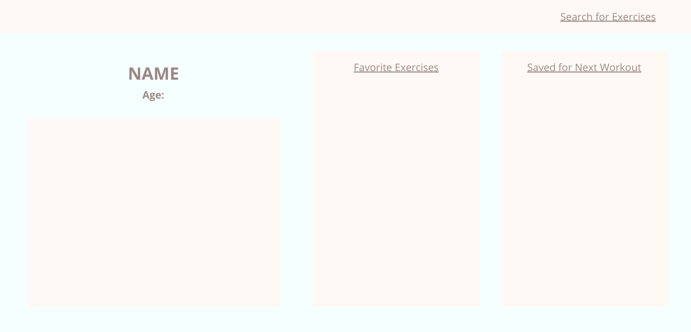
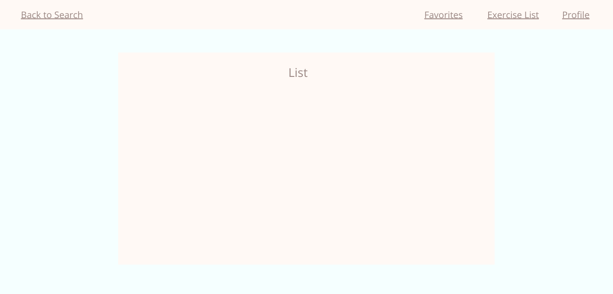

# Heavy Things Tracker

## Install
1. Go to https://www.exercisedb.io/ and sign up for free acocount
2. Download code to your terminal, then run then install the following packages: 
     * `npm i`
     * `npm axios`
     * `npm method_override`
3. Open code
4. In browser, go to https://www.exercisedb.io/ and sign up for free acocount for API token
5. Once account is verified, click on Dashboard, then API TOKEN
6. Uncover your token to copy and paste in the `.env` file
7. `env` file should look like this:
     ```
     API_KEY=Token_<Your API Token>
     SUPER_SECRET_SECRET=<Any word you want>
     ```

## Tech Stack
* Postgres
* Express
* Node.JS

## Wireframes
* Welcome Page

* User Profile

* Search

* Same Layout for Results, Favorites, & Saved Lists

* Detailed Exercise


## API
* ExerciseDB

## ERD


## Examples of API Data
API root = https://wger.de/api/v2/<:param>/?language=2
* Exercise = exercise/
     1. Name = results.name
     2. Description = results.description
     3. Muscle group = results.category
     4. Primary muscle = results.muscles
     5. Secondary muscles = results.muscles_secondary
* Image = exerciseimage/
     1. Image = results.image
* Muscle Group = exercisecategory/
     1. id = results.id
     2. name = results.name
* Muscles = muscle/
     1. id = results.id
     2. name = results.name
* Cues = exercisecomment/
     1. id = results.id
     2. name = results.name
     3. cue = results.comment

## MVP
* Welcome page that renders login/sign up
* User profile page that displays basic user info, favorited exercises, and exercises user saved for next workout
* Categorize save for next workout list by muscle group
* User will be able to search for exercises with option to add to two lists:
     1. favorite exercises
     2. save for next workout
* User will be able to go to their own page for favorites and saves
     * each with their own delete button
     * saves will have a comment section for user to add notes on when/what type of workout they're saving exercise for

## Stretch Goals
* Use a second API to call for inspirational fitness quotes
* Create a workout tracker for users
* Allow users to upload progress photos
* Styling

## Potential Roadblocks
* Some of the data returned might be in German
* Narrowing down what to search by
* Adding on too many ideas/changing which idea I want to develop