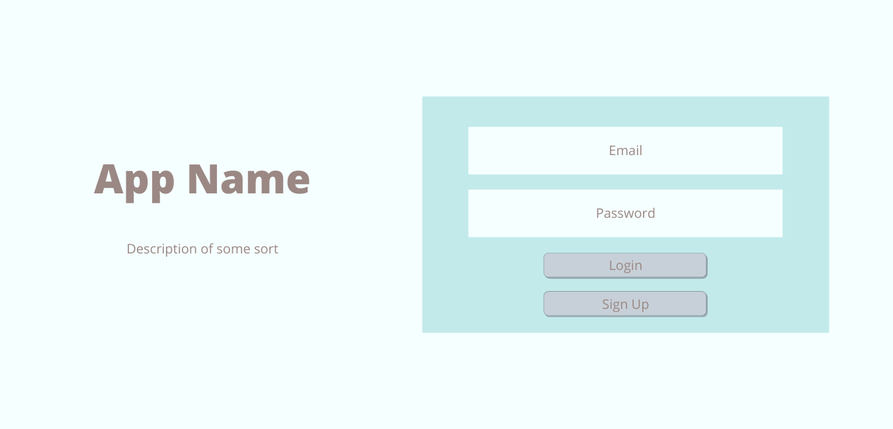

# Heavy Things Tracker

## RESTful Routes


## Install
1. Go to https://www.exercisedb.io/ and sign up for free acocount
2. Download code to your terminal, then run then install the following packages: 
     * `npm i`
     * `npm axios`
     * `npm method_override`
3. Open code
4. In browser, go to https://www.exercisedb.io/ and sign up for free acocount for API token
5. Once account is verified, click on Dashboard, then API TOKEN
6. Uncover your token to copy and paste in the `.env` file
7. `.env` file should look like this:
     ```js
     API_KEY=Token_<yourApiToken>
     SUPER_SECRET_SECRET=<anyWordYouWant>
     ```

## Tech Stack
* Postgres
* Express
* Node.JS
* CSS/Bootstrap

## Wireframes
* Welcome Page

* User Profile

* Search

* Same Layout for Results, Favorites, & Saved Lists

* Detailed Exercise


## API
* ExerciseDB

## ERD


## Examples of API Data
API root = https://v1.exercisedb.io/api/exercises/<:param>
* Body Part = bodyPart/{bodyPart}
     1. "back"
     2. "chest",
     3. "lower arms",
     4. "lower legs",
     5. "shoulders",
     6. "upper arms",
     7. "upper legs",
     8. "waist"
* API results:
```js
[
  {
    "bodyPart": "string",
    "equipment": "string",
    "id": "string",
    "name": "string",
    "target": "string",
    "gifUrl": "string"
  }
]
```

## MVP
* Welcome/home page that renders login/sign up
* User profile page that displays user's saved exercises and logged workouts
* User will be able to search for exercises based on body part
* User will be able to save an exercise and their saved exercise index/list will be categorized by muscle group
* User will be able to log completed workouts with details of:
     * date completed
     * duration of workout
     * type of workout
     * comments on workout

## Stretch Goals
* Create second CRUD allowing users to
     * create planned workouts
     * display all planned workouts
     * update planned workouts
     * mark planned workouts as complete and display on workout history
* Use a second API to call for inspirational fitness quotes
* Allow users to upload progress photos/photos from workout
* Styling

## Potential Roadblocks
* Narrowing down what to search by
* Adding on too many ideas/changing which idea I want to develop